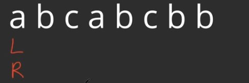
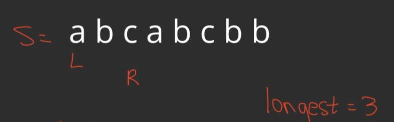
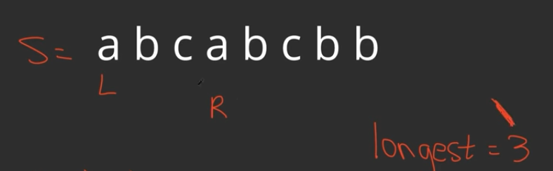
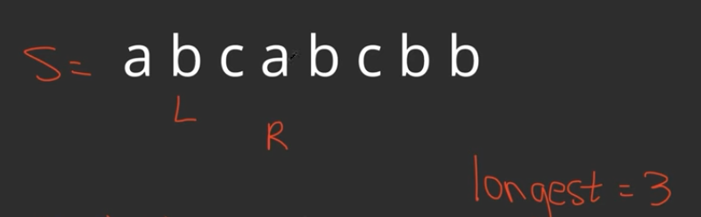
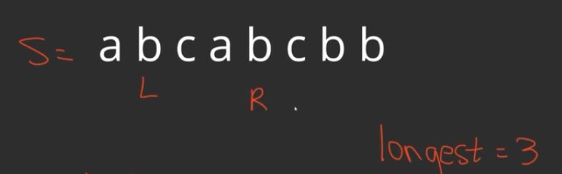
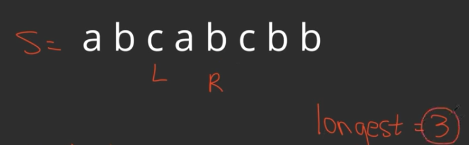
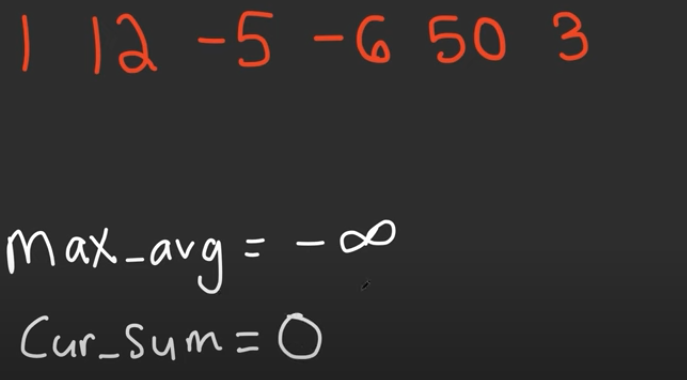
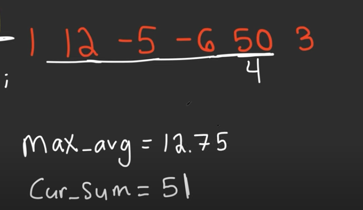

This is an algorithm used for <span style="color:rgb(255, 0, 0)">arrays and strings.</span>

We have two forms for this algorithm:

- **Variable length sliding window**: used for problems when we want to compute a subarray of a variable size **(for example k <= 3).**

- **Fixed length sliding window**: used for problems when we need to compute a subarray of a fixed size. **For example k = 3.**

USED FOR SUBARRAYS AND SUBSTRINGS. When we have this kind of problems we need to think about this algorithm.

## Variable length

We see how it works with an example.

<span style="color:rgb(0, 176, 240)">Problem 2 of Leetcode</span> 

Given a string s, find the length of the longest substring without repeting characters. We are looking for a substring that can be of any length.

Input = s = "abcabcbb"
Output = 3

1. Initially we set two pointers L(Left) and R(right) that start at the beginning.
2. We now<span style="color:rgb(255, 192, 0)"> look at if we need a specific data structure to help us handle the problem</span>. In our case, because we want to know which elements are in our window at a given time, and they cannot be repeated, we can use a set.
	 set A = {1,2,3}         set B = {2,3,6,4}   NOT a set = {2,2,3,4,5,6,7}
	 
3.  We now start moving the pointers accordingly. We move R to the right until the window is not valid. In this case, we move the pointer R to the right until we reach a repeated letter. Every time, we find a non repeated letter, we increase the maximum length of the window that was found.


4.  Once we move R and we reach a non valid value such as the following situation(letter "a" repeated): 
We now move L to the right until the window is valid again.

Now, we have reached a new valid window. Its length is the same as the previously detected one so it is not updated

5.  As the window is again valid, we would start moving R again, reaching the following situation:

Now the window would be invalid again (repeating b). Therefore, we would now start moving  L again until finding another valid interval.


6. We would now keep moving R again upon finding a valid interval and repeat the process over and over and over. We would finish the whole process when R reaches the end of the array.

**We now show the python implementation for this program number 2 from Leetcode **

```python
class Solution:
	def lengthOfLongestSubstring(self, s:str) -> int;

		l = 0
		maximum_length = 0
		numbers = set()
	for r in range(0,len(s)):
	
		// While the interval is not valid(repeated letter):
		
		 while(s[r] in numbers):
			 numbers.remove(s[l])
			 l+= 1
			 
		// In this moment we have a valid window

		// NEW WINDOW LENGTH
		w = r - l + 1

		// We add the leftmost element of the new valid window
		numbers.add(s[w])
		maximum_length = max(maximum_length, w)

	return maximum_length
			
```

Despite the time complexiting looking as if it was O(n²), it is actually O(n).

for r in range(0,len(s)): **This runs n times**
	
// While the interval is not valid(repeated letter):
		
 while(s[r] in numbers):
 **This is going to go through the numbers of the array once, in total it will run n times after all the while iterations**
 
	 numbers.remove(s[l])
	 l+= 1

As a result, it is O(n) ->outer loop + O(n) -> inner loop = O(n).
## Fixed length

<span style="color:rgb(0, 176, 240)">Problem 643 of Leetcode</span> 

We need to find the maximum average subarray whose length is equal to k and return the value of that average.

For example: WE ARE GIVEN K = 4 AND ARRAY [1, 12, -5, -6, 50, 3]

1. First we set the maximum_average value of the subarrays evaluated and the current_sum of the array.


2.  We know build the first window of the given size. In order to do that we move the index i and increase the current_sum of the interval until we reach the value of k.


3. We now compute(for this problem), the current average of our window.

4. We now move the window mantaining the valid length. In order to do so, we would move to the right once adding that value to the current sum and then subtracting the value from the leftmost side.


We updated the average as it was greater than the previously computed one.

5. We  repeat this process until we have the rightmost index on the last element of the array so the algorithm finishes.


ACTUALLY CUR_SUM += nums[i] - nums[i - k]

```python
class Solution:
	def findMaxAverage(self, nums:List[int], k:int) -> float:
		cur_sum = 0
		n = len(nums)

		// We initially construct the window of size k
		for counter in range(k):
			cur_sum += nums[counter]
			
		maximum_average = cur_sum / k

		// We start at k as it is the first non analyzed element of 
		// the array
		for r in range(k, n):
			cur_sum = cur_sum + nums[r] - nums[r - k]
			new_average = cur_sum / k
			maximum_average = max(maximum_average, new_average)

		return maximum_average
			

```

We observe that this solution is O(n) as we traverse the n elements of the array once by using two separated loops(pieces) that visit the n elements together.
