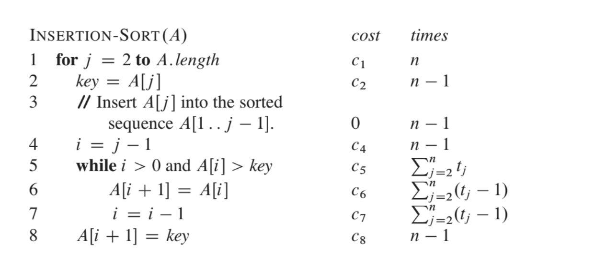
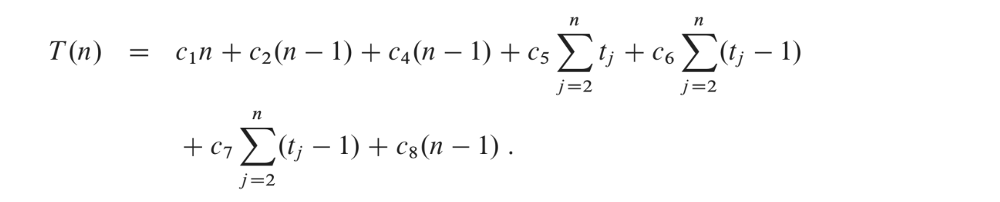
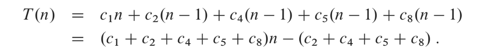
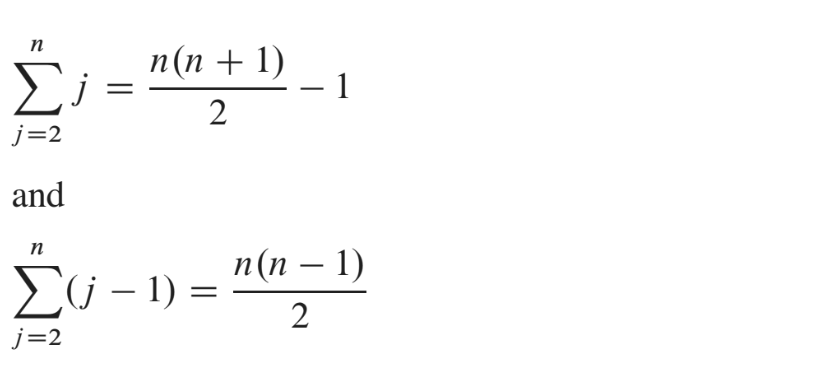
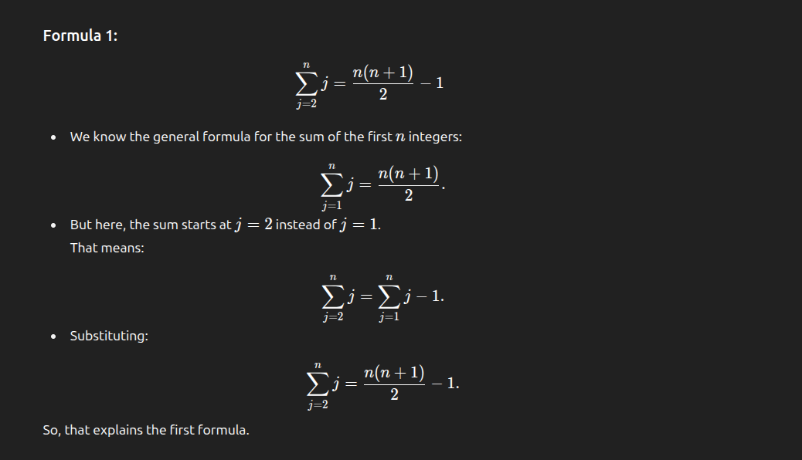
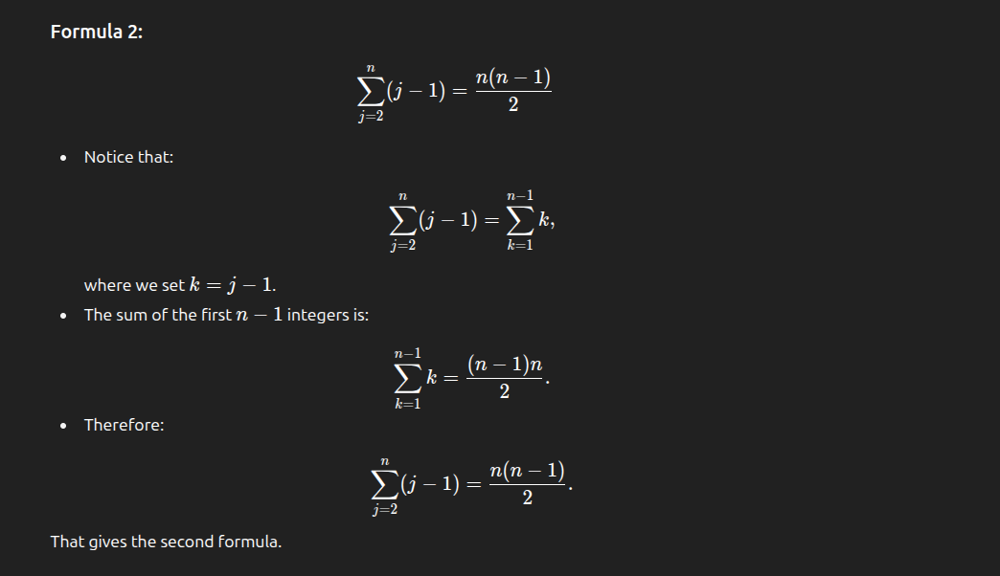
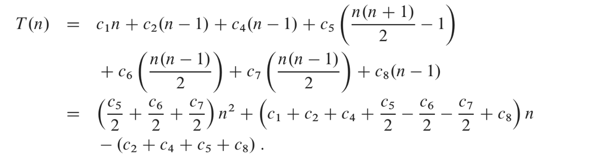
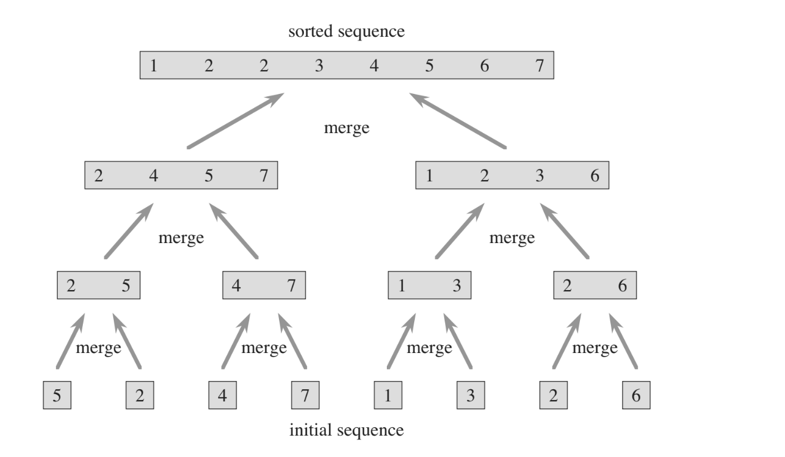
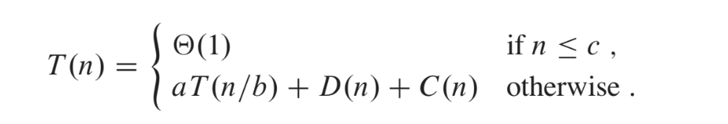
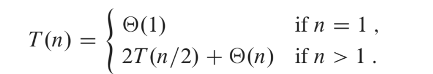

# <span style="color:rgb(0, 176, 240)">Normal analysis</span>
## <span style="color:rgb(145, 215, 232)">Example 1. Insertion sort</span>


In the following drawing we observe the time complexity analysis for each of the instructions. We take into account the following considerations:

- <span style="color:rgb(255, 192, 0)">n = A.length</span>

-  <span style="color:rgb(255, 192, 0)">tj denotes the number of times the while loop test in line 5 is expected to be executed for that value of j.</span> 

- Comments are assumed to be non executable

The running time of the algorithm is the sum of running times for each statement executed; a statement that takes ci steps to executes and executes n times will contribute ci * n times.

TO COMPUTE T(n),the running time of INSERTION-SORT on an input of n values, we sum the products of the cost and times columns, obtaining the following:



<span style="color:rgb(146, 208, 80)">Even for inputs of a given size, an algorithm's running time may depend on which input of that size is given. For example, in INSERTION-SORT, the best case occurs when the array is already sorted.</span> 

<span style="color:rgb(146, 208, 80)">For each iteration of the for loop, we would go to the while loop and we would just execute its condition and determine that A</span>[j] <= <span style="color:rgb(146, 208, 80)">key in line 5. As a result, tj = 1 for every j. Knowing this, the best running time will be:</span>



**THIS RESULT, CAN BE EXPRESSED AS an + b for constants a and b that depend on the statement costs ci; it is thus a linear function of n.**  <span style="color:rgb(146, 208, 80)">Therefore, Ω(n)</span>

The worst case scenario happens when we have the array sorted in reverse order, requiring in each iteration of the for loop to go within the while to compare each element A[j] with each element of the sorted subarray A[i... j - 1 ]. As a result, tj  = j.(j = 2, 3, 4, 5, 6, 7, 8, 9...)

We need to take into account the following formulas to develop the expression:



EXPLANATION OF HOW THEY WERE OBTAINED:


k = j -1; If j = n then k = n -1 that is why the summation gets transformed to n - 1 as upper limit.

Knowing these, we obtain the following time function:



This worst-case running time as an² + bn + c for constants a, b and c that again depend on the statement costs ci. It is a quadratic function. <span style="color:rgb(255, 0, 0)">Therefore, O(n²)</span>

<span style="color:rgb(255, 192, 0)">We are now going to analyze the average case scenario.
</span> 

This is considering the case in which we take an array in which the numbers are placed in random positions. On average, half the elements in A[1... j - 1] are less than A[j], and half the elements are greater. On average, therefore, we check half of the subarray A[1... j - 1] so tj = j / 2. The resulting average-case turns out to be a quadratic function of the input size, just as the worst case.

## <span style="color:rgb(0, 176, 240)">Example 2. Recursive algorithms: Mergesort</span> 

# Tree recurring method

When an algorithm contains a recursive call to itself, we can often<span style="color:rgb(145, 215, 232)"> describe its running time by a recurrence equation or recurrence,</span> which describes its the overall running time on a problem of size n in terms of the running time of smaller inputs. We can then use mathematical tools to solve the recurreence and provide bounds on the performance of the algorithm.



<span style="color:rgb(145, 215, 232)">We let T(n) be the running time of a problem of size n. </span>If the problem size is small enough, say n <= c for some constant, the solution takes constant time, which we write as Θ(1).

If we suppose that our division of the problem yields a subproblems, each of which is 1/b the size of the original. (For merge sort, both a and b are 2).<span style="color:rgb(145, 215, 232)"> It takes time T(n/b) to solve one subproblem of size n/b and so it takes at(n/b) to solve a of these problems.</span>

Now,<span style="color:rgb(145, 215, 232)"> if we consider D(n)  time to divide the problem into subproblems and C(n) time to combine the solutions to the subproblems into the solution to the original problem, we get the following recurrence:</span>



<span style="color:rgb(145, 215, 232)">TIME TO SOLVE a problems + TIME TO DIVIDE into subproblems + TIME TO MERGE -> aT(n/b) + D(n) + C(n)</span> 

FOR MERGE SORT SPECIFICALLY we need to consider the following:
- <span style="color:rgb(0, 176, 240)">Divide </span>: We compute the middle of the subarray. Due to being a division it takes constant time D(n) = Θ(1).

- <span style="color:rgb(0, 176, 240)">Conquer:</span> We recursively solve the two subproblems, each of size n/2, which contributes 2T(n/2) to the running time.

-<span style="color:rgb(0, 176, 240)"> Combine: </span>The merge procedure takes Θ(n)



Notice that Θ(1)+Θ(n) = Θ(n) this is why in the second line Θ(1) is not shown.

As we observe, we need to solve the following recursive equation.

```cpp
T(n) = 2T(n/2) + c*n (Cost of sorting the two subproblems + merging the results)

We now expand the expression

T(n)  = 2*(2T(n/4) + c * n/2) + c*n = 
2²T(n/2²) + 2¹c*n = 4*(2T(n/2³+ c* n/4)) + 2c*n = 2³T(n/2³) + 3c*n

We observe that there is a pattern
2^i T(n/2^i) + i * c * n

We now consider that we have reached the base case in which n/2^i = 1 -> n= 2^i
As a result, i= log2(n) being i the number of iterations or executions

We substitute in the relation that we originally obtained

2^log2(n)T(n/2^log2(n)) + log2(n) *c * n

n*T(n/n) + c*nlog2(n)  -> n* T(1) + c*n*log2(n) -> n* k(arbitary constant) + c*n*log2(n) = O(n) + O(nlog(n)) = O(nlog(n))

In conclusion: T(n) = O(nlog(n))

```


# Master method(THEOREM)

This is a direct way to solve recurrence relations of the following form by following the theorem stated in the next lines:

```
If you have T(n) = aT(n/b) + O(n^d) (for constants a > 0, b> 1 , d >= 0) then:
CASES
If d > logb(a) then O(n^d)
if d = logb(a) then O(n^d * log(n))
if d < logb(a) then O(n^(logb(a)))
```

- <span style="color:rgb(255, 192, 0)">T(n) = 4T(n/2) + O(n ^1)</span> 
	- We observe that: a = 4, b = 2 and d = 1. As a result: 1 < log2(4) -> 1 < 2 We are in  CASE 3
	Therefore, the solution is O(n^log2(4)) = O(n²)

- <span style="color:rgb(255, 192, 0)">T(n) = 3T(n / 2) + O(n)</span>
	- We observe that a = 3, b = 2 and d = 1. As a result, 1 < log2(3). We are in CASE 3 again.
	Therefore, the solution is O(n^log2(3))

-<span style="color:rgb(255, 192, 0)"> T(n) = 2T(n / 2) + O(n)</span>
	- We observe that a = 2, b = 2 and d = 1. As a result, 1 = log2(2) -> 1 = 1 We are in CASE 2
    Therefore, the solution is O(n¹ * log(n)) = O(n * log(n))

- <span style="color:rgb(255, 192, 0)">T(n) = T(n / 2) + O(n⁰)</span>
	- We observe that a = 1, b = 2, d = 0. As a result, 1 log2(1) 1 > 0 We are in CASE 0
     Therefore, the solution is O(n⁰) = O(1)


# Substitution method


# <span style="color:rgb(0, 176, 240)">Example 3. Amortized sums </span> 
